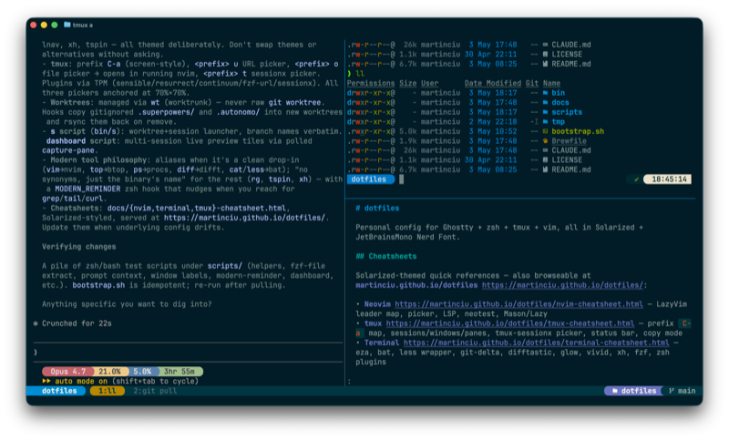
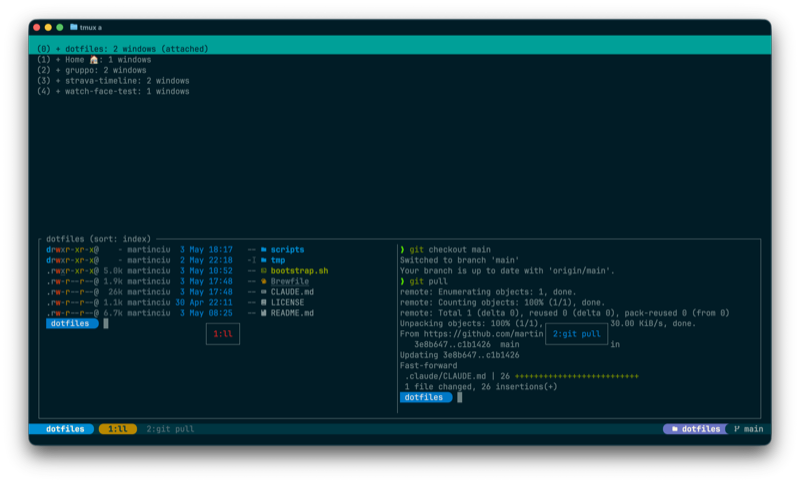
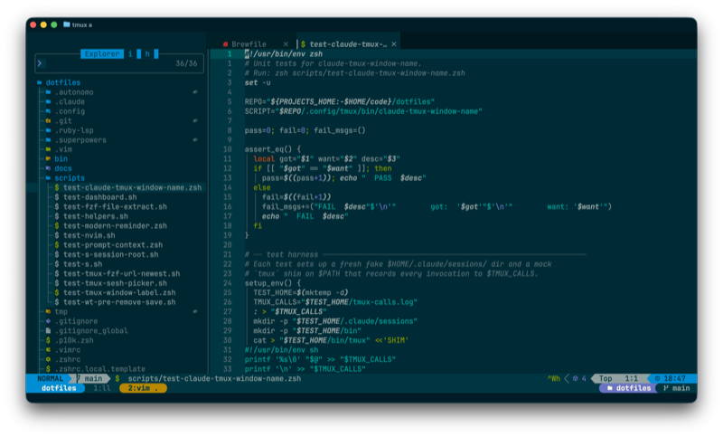

# dotfiles

Personal config for Ghostty + fish + tmux + vim, all in Solarized + JetBrainsMono Nerd Font.

<p align="center">
  <a href="docs/images/example_terminal.png"></a>
  <a href="docs/images/example_tmux.png"></a>
  <a href="docs/images/example_vim.png"></a>
</p>

## Cheatsheets

Solarized-themed quick references — also browseable at
[martinciu.github.io/dotfiles](https://martinciu.github.io/dotfiles/):

- [Terminal](https://martinciu.github.io/dotfiles/terminal-cheatsheet.html) — eza, bat, less wrapper, git-delta, difftastic, glow, vivid, xh, duf, dust, dua, fzf
- [tmux](https://martinciu.github.io/dotfiles/tmux-cheatsheet.html) — prefix `C-a` map, sessions/windows/panes, tmux-sessionx picker, status bar, copy mode
- [Neovim](https://martinciu.github.io/dotfiles/nvim-cheatsheet.html) — LazyVim leader map, picker, LSP, neotest, Mason/Lazy

## Setup (new machine)

Detailed conventions and reasoning live in `CLAUDE.md`. This section is the
operational checklist.

1. Install Homebrew (https://brew.sh).
2. Export `PROJECTS_HOME` (e.g. `export PROJECTS_HOME="$HOME/code"`) and
   clone this repo to `$PROJECTS_HOME/dotfiles`.
3. Install brew packages: `brew bundle --file=$PROJECTS_HOME/dotfiles/Brewfile`.
4. Run the symlinker: `$PROJECTS_HOME/dotfiles/bootstrap.sh` (idempotent;
   safe to re-run). Also installs uv-managed CPython 3.13 as the global
   `python3` (`~/.local/bin/python3`); Apple's stays at `/usr/bin/python3`
   for system use.
5. Apply the **manual extras** below — `bootstrap.sh` cannot automate these.
6. Open tmux and press `<prefix> I` (capital I, prefix = `C-a`) to install
   TPM plugins.

### Manual extras

**1. Login shell — fish.** `bootstrap.sh` installs the fish config and copies
`15-local.fish` / `99-secrets.fish` from templates, but it does *not* change
your login shell. Enable manually:

```sh
# One-time: register fish as a valid login shell
echo /opt/homebrew/bin/fish | sudo tee -a /etc/shells

# Edit the per-machine fish overlays:
$EDITOR ~/.config/fish/conf.d/15-local.fish    # PROJECTS_HOME, PATH overrides
$EDITOR ~/.config/fish/conf.d/99-secrets.fish  # API keys etc.

# Switch login shell to fish
chsh -s /opt/homebrew/bin/fish
```

After `chsh`, open a new Ghostty tab (or `exec /opt/homebrew/bin/fish` to
hot-swap an existing pane).

**2. `~/.config/sesh/sesh.local.toml`** — `bootstrap.sh` copies the template
on first run. Edit it to add machine-local project sessions; the shared
`sesh.toml` is the wrong place for them.

**3. Wire delta into git** (one-time, global). The include line picks up
delta's theme + chip tweaks from the active theme (see "Switching themes"
below — `theme-set` flips the included file).

```sh
git config --global core.pager delta
git config --global interactive.diffFilter "delta --color-only"
git config --global delta.navigate true
git config --global delta.line-numbers true
git config --global include.path "~/.config/themes/delta-current.gitconfig"
```

**4. Claude Code window-title hooks.** `~/.claude/settings.json` is not
symlinked from this repo (it accumulates machine-local permission state),
so this is a one-time manual edit. Add (or merge into) the top-level
`hooks` object:

```json
"SessionStart": [
  { "hooks": [ { "type": "command",
    "command": "~/.config/tmux/bin/claude-tmux-window-name set" } ] }
],
"Stop": [
  { "hooks": [ { "type": "command",
    "command": "~/.config/tmux/bin/claude-tmux-window-name set" } ] }
],
"SessionEnd": [
  { "hooks": [ { "type": "command",
    "command": "~/.config/tmux/bin/claude-tmux-window-name clear" } ] }
]
```

These drive the `claude[<name>]` window title (tmux's
`automatic-rename-format` reads `@claude_session_name`).

## What's where

| Tool         | Source path                          | Target              |
| ------------ | ------------------------------------ | ------------------- |
| [Ghostty](https://ghostty.org/) | `.config/ghostty/`        | `~/.config/ghostty` |
| [tmux](https://github.com/tmux/tmux) | `.config/tmux/`      | `~/.config/tmux`    |
| [nvim](https://neovim.io/) | `.config/nvim/`                | `~/.config/nvim`    |
| [vim](https://www.vim.org/) | `.vimrc`, `.vim/colors/`      | `~/.vimrc`, `~/.vim/colors` |
| [fish](https://fishshell.com/) | `.config/fish/`              | `~/.config/fish/`   |
| [sesh](https://github.com/joshmedeski/sesh) | `.config/sesh/sesh.toml` | `~/.config/sesh/sesh.toml` |
| [worktrunk](https://worktrunk.dev/) | `.config/worktrunk/` | `~/.config/worktrunk` |
| [glow](https://github.com/charmbracelet/glow) | `.config/glow/` | `~/.config/glow` |
| [tailspin](https://github.com/bensadeh/tailspin) | `.config/tailspin/` | `~/.config/tailspin` |
| [lnav](https://lnav.org/) | `.config/lnav/{configs,formats}/installed/` | `~/.config/lnav/{configs,formats}/installed` |
| [btop](https://github.com/aristocratos/btop) | `.config/btop/` | `~/.config/btop`    |
| [procs](https://github.com/dalance/procs) | `.config/procs/` | `~/.config/procs`   |
| [xh](https://github.com/ducaale/xh) | `.config/xh/` | `~/.config/xh` |
| [ccstatusline](https://github.com/sirmalloc/ccstatusline) | `.config/ccstatusline/` | `~/.config/ccstatusline` |
| [Claude](https://claude.com/claude-code) | `.claude/CLAUDE.md` | `~/.claude/CLAUDE.md` |
| user bin     | `bin/*` (e.g. `s`)                   | `~/.local/bin/*`    |

## Switching themes

Three themes are wired: **Solarized Dark** (default), **Catppuccin Mocha**, and **Dracula**.
Swap via the fish function `theme-set`:

```fish
theme-set mocha       # switch to Catppuccin Mocha
theme-set dracula     # switch to Dracula
theme-set solarized   # switch back
```

The function flips per-tool symlinks under `~/.config/themes/`,
`~/.config/ghostty/theme.ghostty`, `~/.config/starship.toml`,
`~/.config/glow/glamour.json`, `~/.config/gh-dash/config.yml`,
`~/.config/lnav/configs/installed/theme.json`, plus a
`delta-current.gitconfig` snippet included via the gitconfig
`include.path` directive set up during `Setup` above. It also sets
`$BAT_THEME` as a fish universal variable.

**Reloads live:** tmux (status bar + helpers, instant), ghostty,
starship (next prompt render), glow, delta (next `git diff`).

**Needs restart:** open shells (`$BAT_THEME` is read at process start),
nvim, gh-dash, lnav.

**Add a third theme:** drop a new `.config/themes/<name>.tmux` palette
file (mirror the role keys from the existing palettes) plus per-tool
`*-<name>.<ext>` variant configs, then extend the `switch` statement
in `.config/fish/functions/theme-set.fish`.

Smoke test: `scripts/test-theme-switch.sh`.

## Keymaps quick-ref

- tmux prefix: `C-a`
- session switcher (tmux-sessionx): `<prefix> t`  (clock-mode moved to `<prefix> T`)
- pane nav: `<prefix> h/j/k/l` (Alt is reserved for Polish diacritics)
- splits: `<prefix> |` (right) / `<prefix> -` (down)
- reload tmux: `<prefix> r`
- TPM plugin install: `<prefix> I` (capital I)
- worktree+session command (any shell): `s [<project>] [<name>]` — inside tmux 1 arg = worktree name in current project; outside tmux 1 arg = project name (attach), 0 args = fzf picker. Branch name verbatim — the `worktree-` prefix is reserved for the `EnterWorktree` workflow.

## Status bar (right side)

`<project> · <git/worktree>`

- Project chip (violet) is the top-level dir under `$PROJECTS_HOME`.
- Git chip is **cyan** in main checkout, **yellow** in a worktree.
  Worktree label `wt:NAME` only shows when branch name differs from worktree dir name.

## Quirks

- URLs in tmux panes open with **Shift+Cmd+click**, not Cmd+click.
- Why: with `set -g mouse on`, Ghostty defers all mouse interactions (incl. URL hover/click detection) to tmux. Ghostty's default `mouse-shift-capture = false` makes Shift the bypass modifier — Shift releases the click from tmux and Cmd reaches Ghostty's URL handler.
- File-reference links printed by Claude Code (OSC 8 hyperlinks to `file:///abs/path`) open with **Shift+Cmd+click** — same modifier as URLs. Routing to VS Code (or whichever editor) happens via the existing macOS file-type defaults (Finder → Get Info → "Open with" → "Change All"); no extra config in this repo.
- Smoke-test that the chain works end-to-end:

  ```sh
  printf '\e]8;;file://%s/.config/fish/config.fish\e\\config.fish\e]8;;\e\\\n' "$HOME"
  ```

  Shift+Cmd+click the rendered "`config.fish`" — your default editor for that file type should open it.
- **Dashboard (`bin/dashboard`) is experimental.** Spawns a tiled
  `dashboard-<derived>` session that polls `capture-pane` for every
  matched session — useful for keeping eyes on N parallel runs at
  once. Wired up and tested for the author's daily flow, but not
  battle-hardened: edge cases around layout, pagination, and
  re-discovery may misbehave. Expect the surface (flags, bindings,
  session-name shape) to shift. Cheatsheet card:
  [`docs/tmux-cheatsheet.html`](docs/tmux-cheatsheet.html#dashboard).
